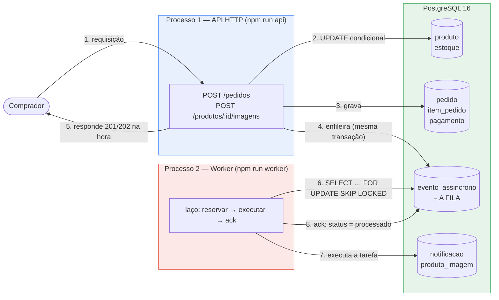
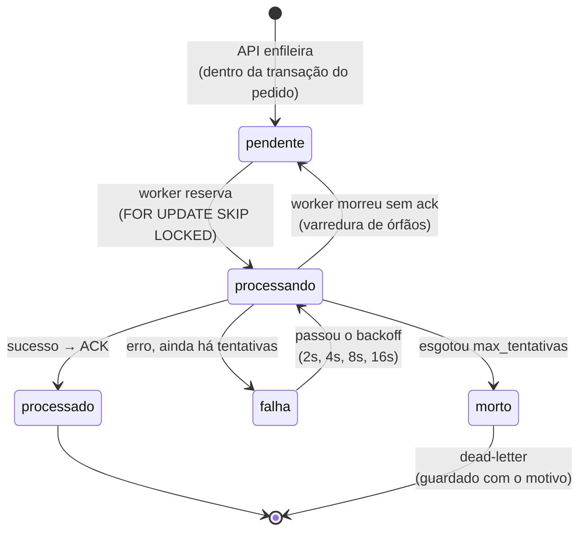

# Relatório — Concorrência e processamento assíncrono no Origem

**Disciplina:** Fundamentos de Computação Concorrente, Paralela e Distribuída (FCCPD) — Unidade 1
**Projeto:** Origem — marketplace de artesanato e economia criativa de Pernambuco
**Repositório:** <https://github.com/thainapontes/Marketplace-da-economia-criativa>
**Branch desta entrega:** `feat/fccpd-concorrencia`

---

## Sumário

1. [Pontos concorrentes do sistema](#1-pontos-concorrentes-do-sistema)
2. [Controle de concorrência no checkout](#2-controle-de-concorrência-no-checkout)
3. [Fila assíncrona](#3-fila-assíncrona)
4. [Metodologia e resultados dos testes](#4-metodologia-e-resultados-dos-testes)
5. [Como executar](#5-como-executar)
6. [Uso de ferramentas de IA](#6-uso-de-ferramentas-de-ia)
7. [Limitações assumidas](#7-limitações-assumidas)

---

## 1. Pontos concorrentes do sistema

O Origem é um marketplace: vários compradores usam o sistema **ao mesmo tempo**, sobre os
mesmos dados. Um ponto é *concorrente* quando duas execuções simultâneas podem se atropelar
porque disputam um mesmo recurso compartilhado. Três pontos foram identificados no projeto:

| # | Ponto | Por que é concorrente | Tratamento nesta entrega |
|---|---|---|---|
| 1 | **Baixa de estoque no checkout** | `produto.estoque` é uma linha única disputada por todos os compradores daquela peça. Artesanato tem tiragem pequena — estoque 1 ou 2 é o caso normal, não a exceção, então a disputa é frequente e cara | ✅ resolvido (seção 2) |
| 2 | **Notificação de pedido confirmado** | Não disputa dado, mas ocupa o caminho da resposta HTTP: enquanto o servidor conversa com um serviço externo, aquela requisição está parada e a conexão, presa | ✅ tirado do caminho (seção 3) |
| 3 | **Processamento de imagem de produto** | Trabalho pesado de CPU. Em Node, o JavaScript da aplicação roda em **uma única thread**: um cálculo longo dentro do servidor bloqueia *todas* as requisições, inclusive as que nada têm a ver com imagem | ✅ tirado do caminho (seção 3) |

O ponto 1 é um problema de **corretude** — o dado fica errado. Os pontos 2 e 3 são de
**vazão e disponibilidade** — o dado fica certo, mas o sistema fica lento e frágil. São
problemas diferentes e por isso recebem soluções diferentes: exclusão no banco para o
primeiro, fila assíncrona para os outros dois.

### 1.1 O bug já existia no código da equipe

O checkout original, feito na "Fake API" do frontend
([`frontend/src/services/api/produtos.service.ts`](frontend/src/services/api/produtos.service.ts),
função `removerEstoque`), confere o estoque numa passada e escreve em outra. Esse padrão se
chama **check-then-act** (conferir e agir em dois passos separados) e é a causa clássica de
*race condition*: existe uma janela entre conferir e escrever.

A versão "ingênua" exigida para a comparação, portanto, **não foi inventada para o
trabalho** — é o código real do projeto, reescrito em SQL e preservado em
[`backend/src/checkout-ingenuo.js`](backend/src/checkout-ingenuo.js).

Na direção oposta, a **seção 7 do [`docs/Origem_DDL.md`](docs/Origem_DDL.md)** já descrevia a
solução correta e o DDL já trazia `CHECK (estoque >= 0)`. A modelagem da equipe estava certa;
o que faltava era a implementação — que é o objeto desta entrega.

### 1.2 Como a falha acontece

Produto com `estoque = 1`; Ana e Bruno compram no mesmo instante:

| tempo | Ana | Bruno | estoque |
|:--|:--|:--|:--:|
| t1 | `SELECT estoque` → **1** | | 1 |
| t2 | | `SELECT estoque` → **1** | 1 |
| t3 | `1 >= 1`? sim → pode vender | | 1 |
| t4 | | `1 >= 1`? sim → pode vender | 1 |
| t5 | `UPDATE SET estoque = 0` | | **0** |
| t6 | | `UPDATE SET estoque = 0` | **0** |
| t7 | `INSERT pedido` → 201 | | 0 |
| t8 | | `INSERT pedido` → 201 | 0 |

Dois pedidos para uma peça. O furo está entre t2 e t6: Bruno decidiu com uma informação que
venceu em t5. A escrita de Ana foi apagada pela de Bruno — fenômeno chamado **lost update**
(atualização perdida).

---

## 2. Controle de concorrência no checkout

### 2.1 Técnica escolhida: UPDATE condicional atômico dentro de transação

Implementação em [`backend/src/checkout-seguro.js`](backend/src/checkout-seguro.js):

```sql
BEGIN;
  UPDATE produto
     SET estoque = estoque - :qtd
   WHERE id = :id AND status = 'ativo' AND estoque >= :qtd;   -- 0 linhas => sem saldo
  INSERT INTO pedido ...;
  INSERT INTO item_pedido ...;
COMMIT;
```

Três decisões, cada uma essencial:

1. **`SET estoque = estoque - :qtd`** — a aplicação envia a *operação*, não um valor que
   calculou antes. O banco lê o saldo no instante exato da escrita, então não existe valor
   vencido na mão da aplicação.
2. **`AND estoque >= :qtd` no `WHERE`** — conferir e escrever passam a ser **um único
   comando SQL**, e um comando SQL é **atômico** (indivisível). A janela entre "conferi" e
   "escrevi" deixa de existir: não há mais onde outra transação se encaixar.
3. **`rowCount === 0` significa "não deu"** — o `UPDATE` não gera erro, simplesmente não
   afeta nenhuma linha. A aplicação faz `ROLLBACK` e responde **HTTP 409 Conflict**.

### 2.2 Por que isso basta: o lock de linha

**Lock de linha** (*row-level lock*) é a trava que o PostgreSQL coloca automaticamente numa
linha quando uma transação a modifica; ela dura até `COMMIT` ou `ROLLBACK`. Analogia: o
cadeado do banheiro do avião — não trava o avião, trava a cabine, e quem chega espera na fila
em vez de receber erro.

Com duas compras simultâneas do mesmo produto, o banco faz:

1. **Bloqueia** — a segunda transação tenta modificar uma linha travada e é posta para
   dormir. Não é erro; do lado do usuário são alguns milissegundos a mais.
2. **Libera** — a primeira dá `COMMIT` e a trava cai.
3. **Reavalia** — e aqui está o essencial: ao acordar, o PostgreSQL **testa o `WHERE` de novo
   contra a versão mais recente da linha**; ele *não* reaproveita o valor lido antes de
   dormir. (Mecanismo interno: *EvalPlanQual*.) Se o saldo acabou, o `UPDATE` afeta 0 linhas.
4. **Rejeita** — `ROLLBACK` e HTTP 409.

Efeito líquido: o banco **serializou** transações que chegaram juntas, sem uma única linha de
código de sincronização escrita por nós.

### 2.3 Prevenção de deadlock

**Deadlock** (impasse) = duas transações presas esperando uma pela outra para sempre, cada
uma segurando o que a outra precisa. Um carrinho com dois itens torna isso possível: Ana
compra `[1, 7]` e Bruno compra `[7, 1]` — os mesmos produtos em ordem inversa. Ana trava a
linha 1 e pede a 7; Bruno trava a 7 e pede a 1. O PostgreSQL detecta o ciclo em cerca de 1
segundo e mata uma das transações com o erro `40P01`. O sistema não congela, mas um comprador
legítimo recebe um erro aparentemente aleatório — bug intermitente, difícil de reproduzir.

**Solução aplicada:** ordenar os itens por `produto_id` antes dos `UPDATE`s
(`itens.sort((a, b) => a.produtoId - b.produtoId)`). Todas as transações passam a adquirir as
travas na mesma ordem, e Bruno é bloqueado logo no primeiro recurso, antes de segurar
qualquer coisa que Ana precise.

> Deadlock exige um **ciclo** de espera. Com uma ordem única de aquisição, o ciclo é
> impossível, e a espera vira uma fila reta — que sempre anda.

Medição: 40 compras simultâneas com carrinhos em ordem inversa → **0 deadlocks**
([`evidencias/03-deadlock.txt`](evidencias/03-deadlock.txt)).

### 2.4 Alternativas consideradas e por que foram descartadas

| Alternativa | Por que não |
|---|---|
| **Só a transação** (sem `WHERE` condicional) | No isolamento padrão do PostgreSQL (`READ COMMITTED`), duas transações conseguem **ler o mesmo valor antes de qualquer uma escrever**. Transação garante *tudo-ou-nada* e durabilidade, **não exclusão mútua**. A prova está no repositório: `checkout-ingenuo.js` está dentro de uma transação **e erra** |
| **Só o `CHECK (estoque >= 0)`** | No *lost update* o estoque nunca fica negativo — no teste ficou **1**, não −40. O `CHECK` não teria reclamado de nada e o overselling aconteceria igual. Ele protege a **integridade do número**; só o UPDATE condicional protege a **regra de negócio**. As duas camadas se somam: defesa em profundidade |
| **Mutex na aplicação** | Um **mutex** (*mutual exclusion*) é uma trava que vive na memória do processo. Ela funciona entre *threads* (que compartilham memória) e **falha entre processos** (cada um tem a sua própria trava e não sabe da outra). Com duas réplicas da API, Ana pega o mutex da réplica 1 e Bruno o da réplica 2: ninguém espera e o bug volta inteiro — e volta de forma traiçoeira, porque passa nos testes locais, com um processo só, e quebra em produção. Não é hipotético aqui: o deploy é na **Vercel**, que sobe e derruba instâncias automaticamente, e o modelo padrão de escala do Node é rodar vários processos, um por núcleo |
| **`SELECT ... FOR UPDATE`** (travar e depois decidir) | Funciona e é correto, mas exige dois comandos onde um resolve, e mantém a trava por mais tempo sem ganho algum |
| **Travas distribuídas** (Redlock/Redis, *advisory locks* do Postgres) | Corretas do ponto de vista conceitual, mas adicionam infraestrutura e complexidade para um problema que o próprio banco resolve com uma cláusula `WHERE` |
| **Isolamento `SERIALIZABLE`** | Resolveria, mas ao custo de abortar transações por conflito de serialização, exigindo lógica de *retry* em toda a aplicação — mais complexo e mais lento para o caso, que é uma disputa por uma linha só |

**Princípio que resume a escolha:** *o dado é compartilhado no banco, então a trava também
tem que morar no banco.* Proteger um recurso compartilhado com uma trava privada é o erro de
arquitetura por trás de quase todo overselling em produção.

### 2.5 Correspondência com os conceitos da disciplina

O material da disciplina trata sincronização no nível da **memória compartilhada**: threads de
um mesmo processo, protegidas por mutex, semáforo ou monitor (aulas *Sincronização: Seção
Crítica* e *Aula 7 — Semáforos e Monitores*). Esta entrega aplica os mesmos conceitos **um
nível abaixo**, no banco de dados, pelo motivo dado na seção 2.4: o estado compartilhado do
Origem não vive na memória de um processo — vive numa linha de tabela, acessada por processos
distintos, possivelmente em máquinas distintas.

| Conceito da disciplina | Onde ele aparece nesta entrega |
|---|---|
| **Seção crítica** — o trecho que lê e escreve o recurso compartilhado | O trecho que confere e baixa `produto.estoque`. Na versão ingênua ele é o par `SELECT` → `UPDATE`; na segura, um único comando |
| **Exclusão mútua** | O *lock de linha* que o PostgreSQL toma no `UPDATE`: uma transação por vez altera aquela linha (seção 2.2) |
| **Progresso** | O lock é por **linha**, não global: compras de produtos diferentes não esperam umas pelas outras. Um mutex de aplicação travaria o checkout inteiro |
| **Espera limitada** | O banco atende a fila de espera do lock e reavalia a condição ao acordar; nenhuma transação é preterida indefinidamente |
| **Mutex / lock como "passe único de entrada"** | O passe existe — mas mora **no banco**, que é o recurso compartilhado, e não na memória de um processo (seção 2.4) |
| **`unlock()` no `finally` / `with`** | `cliente.release()` no `finally` de `comTransacao()` (`src/db.js`), e o `ROLLBACK` no `catch`: exceção nenhuma pode deixar conexão ou lock presos |
| **Semáforo contador** | Ver abaixo — o estoque **é** um semáforo contador |
| **Monitor** (lock + variável de condição) | A transação cumpre esse papel: o banco junta, numa estrutura só, a trava e a reavaliação da condição (`AND estoque >= :qtd`) ao acordar. Não é um monitor literal — é o mesmo empacotamento de responsabilidades |
| **Deadlock** | Seção 2.3: provocado de propósito no teste e eliminado por ordem única de aquisição — a mesma estratégia que a dinâmica do Jantar dos Filósofos pede para combinar na Rodada 2 |
| **Livelock** | Evitado na fila (seção 3.6) |
| **Starvation** | Evitada na fila pela ordem FIFO (seção 3.6) |

#### O estoque é um semáforo contador

A *Aula 7* abre perguntando: *"e se eu tiver 3 impressoras idênticas e 10 processos
disputando? Um mutex ainda resolve?"* — e responde com o **semáforo contador**, cujo valor
inicial é o número de recursos disponíveis, com `wait/P` decrementando e `signal/V`
devolvendo.

O teste desta entrega é exatamente esse cenário: **10 unidades em estoque e 50 compradores
simultâneos**. E o comando do checkout seguro é a operação `wait/P`:

```sql
UPDATE produto SET estoque = estoque - :qtd
 WHERE id = :id AND estoque >= :qtd;     -- decrementa SE houver vaga
```

Três diferenças em relação ao semáforo da aula, que valem ser ditas em voz alta:

1. **Onde o contador mora.** Num `Semaphore(3)` de Python ou Java, o contador é uma variável
   na memória do processo — e some quando ele cai. Aqui é uma coluna: sobrevive a reinício,
   e é visível para todos os processos, em qualquer máquina.
2. **Não bloqueia: recusa.** O `wait/P` clássico põe a thread para dormir até liberar uma
   vaga. Aqui, se não há saldo, o comando afeta 0 linhas e a API responde **409** de imediato
   — o equivalente a um `tryAcquire()`. Faz sentido no domínio: a peça é única e artesanal, e
   esperar por um estoque que talvez nunca volte seria pior para o comprador que a recusa.
3. **Um `signal/V` também existe**, embora não implementado nesta entrega: o cancelamento de
   pedido, que devolveria as unidades ao contador.

Há ainda um segundo semáforo contador no sistema, esse explícito: `PG_POOL_MAX` (`src/db.js`),
o tamanho do pool de conexões. Ele é o "número de vagas" para conversar com o banco — com
`max = 10`, no máximo 10 checkouts falam com o banco ao mesmo tempo e os demais esperam a vez
dentro da aplicação. É a mesma ideia das 3 impressoras do slide.

---

## 3. Fila assíncrona

### 3.1 Desenho



Os passos 2, 3 e 4 acontecem **na mesma transação**: ou tudo existe, ou nada existe. O passo
5 acontece sem esperar nada do worker. Os passos 6 a 8 acontecem em **outro processo**, em
outro instante — e continuam funcionando mesmo que a API esteja fora do ar.

**Desacoplamento:** a API e o worker não se conhecem. Não há chamada de um para o outro, nem
configuração de endereço, nem dependência de estar no ar. O único ponto de contato é a tabela
`evento_assincrono`. Com o worker desligado, a API vende normalmente e os jobs se acumulam;
quando o worker sobe, ele processa o acumulado.

### 3.2 Tecnologia: uma tabela no próprio PostgreSQL

A fila é a tabela `evento_assincrono`, que **já existia no DDL modelado pela equipe**,
estendida em [`backend/sql/03_fila.sql`](backend/sql/03_fila.sql) com as colunas que
transformam uma tabela de eventos numa fila confiável:

| Coluna | Para que serve |
|---|---|
| `tentativas` / `max_tentativas` | contagem de entregas e limite antes de desistir |
| `disponivel_em` | hora a partir da qual o job pode ser pego — é isto que implementa o backoff |
| `chave_idempotencia` (UNIQUE) | impede enfileirar duas vezes o mesmo efeito |
| `ultimo_erro` | motivo da última falha, para investigar o que foi para a dead-letter |
| `atualizado_em` | usado para detectar jobs órfãos de um worker que morreu |

| Alternativa | Por que não |
|---|---|
| **Redis + BullMQ** | Menos código, mas as garantias ficam escondidas dentro da biblioteca: perguntado "como funciona o ack?", a resposta viraria "a BullMQ faz". Além disso acrescenta um serviço a subir, monitorar e fazer backup — e a durabilidade passaria a depender da configuração de persistência do Redis |
| **RabbitMQ / SQS** | Filas maduras e corretas, mas fora da transação do banco: perde-se o *transactional outbox* da seção 3.4, e a entrega passa a exigir um protocolo bem mais complicado para não divergir do pedido |
| **`setTimeout` / thread dentro da API** | Não sobrevive a um restart (o job vive só na memória), não isola falha e, em Node, disputa a mesma thread do servidor. Falharia quase todos os critérios da rubrica |

A escolha tem um custo honesto: a fila consulta o banco periodicamente (*polling*), o que
gera carga constante, ainda que pequena. Em volume alto, a evolução natural é `LISTEN/NOTIFY`
do PostgreSQL ou um broker dedicado.

### 3.3 Ciclo de vida de um job



### 3.4 Garantias de entrega

| Garantia | Como é obtida | Onde está |
|---|---|---|
| **Persistência** | o job é uma linha do banco; sobrevive à queda do worker, da API e da máquina | `sql/03_fila.sql` |
| **Atomicidade com o pedido** (*transactional outbox*) | o `INSERT` na fila usa a **mesma conexão e a mesma transação** do checkout. Se o pedido der `ROLLBACK`, o job some junto | `src/pedido.js`, `src/fila.js` → `enfileirar()` |
| **At-least-once** | o ack só acontece **depois** do sucesso da tarefa. Se o worker cair no meio, ninguém deu ack e o job volta | `src/worker.js` → `processar()` |
| **Idempotência** | `chave_idempotencia` UNIQUE + `ON CONFLICT DO NOTHING`, tanto ao enfileirar quanto ao gravar o efeito. A chave descreve o **efeito** (`notificar-comprador:42`), não a tentativa | `src/fila.js`, `src/tarefas.js` |
| **Retry com backoff exponencial** | ao falhar, `disponivel_em = now() + intervalo`, dobrando a cada tentativa (2s, 4s, 8s, 16s) | `src/fila.js` → `falhar()` |
| **Dead-letter** | esgotadas as tentativas, `status = 'morto'` com `ultimo_erro` preenchido, inspecionável em `GET /fila` | `src/fila.js` → `falhar()` |
| **Recuperação de órfãos** | jobs presos em `processando` além do tempo limite voltam a `pendente` (*visibility timeout*) | `src/fila.js` → `recuperarOrfaos()` |
| **Sem entrega dupla simultânea** | `SELECT … FOR UPDATE SKIP LOCKED`: cada worker pula as linhas já travadas por outro em vez de esperar por elas | `src/fila.js` → `reservar()` |
| **Desligamento gracioso** | `SIGINT`/`SIGTERM` terminam o job em andamento antes de sair, em vez de abandoná-lo | `src/worker.js` |

**Por que at-least-once, e não exactly-once:** garantir "exatamente uma vez" entre dois
sistemas (a fila e o efeito) é impossível sem transação distribuída, porque sempre existe um
instante entre "executei" e "registrei que executei" em que a queda é possível. A escolha
prática, e padrão da indústria, é garantir **at-least-once** e tornar as tarefas
**idempotentes** — que é o que transforma "pelo menos uma vez" em "o efeito acontece uma vez
só". No teste da seção 4.3 isso é medido: 5 jobs foram reentregues e ainda assim os efeitos
distintos foram exatamente 200.

### 3.5 As duas tarefas

| Tarefa | O que faz | Como é idempotente |
|---|---|---|
| `notificar_pedido` | grava a notificação do pedido confirmado para o comprador e para cada artesã envolvida | `INSERT ... ON CONFLICT (chave_idempotencia) DO NOTHING` |
| `processar_imagem` | calcula o hash SHA-256 do arquivo e marca a imagem como `disponivel` | o hash é determinístico e o `UPDATE` grava sempre o mesmo valor |

O redimensionamento real da imagem **não** é executado: não há biblioteca de imagem no
projeto, e o que a tarefa faz é um trabalho de CPU equivalente em formato (percorrer ~4 MB
com uma função de hash). O critério avaliado é que o trabalho pesado saia do caminho da
resposta HTTP; trocar essa função por `sharp.resize()` não mudaria nada na fila. A decisão
está declarada em comentário no próprio
[`backend/src/tarefas.js`](backend/src/tarefas.js), não omitida.

### 3.6 A fila é o problema do produtor-consumidor

A demonstração ao vivo da *Aula 7* é o **produtor-consumidor** com dois semáforos:

```python
vagas = Semaphore(3)   # espaços livres no buffer
itens = Semaphore(0)   # itens disponíveis para consumir
```

A Etapa 2 é esse mesmo problema, resolvido com uma fila persistente no lugar dos dois
semáforos em memória:

| Produtor-consumidor da aula | Nesta entrega |
|---|---|
| Produtor (thread) | A API HTTP, no checkout (`src/pedido.js`) |
| Consumidor (thread) | O worker, em **processo separado** (`src/worker.js`) |
| `buffer` compartilhado em memória | A tabela `evento_assincrono` |
| Semáforo `itens` — avisa que há o que consumir | *Polling*: o worker pergunta ao banco a cada 500 ms |
| Semáforo `vagas` — limita o tamanho do buffer | Não existe: a fila é ilimitada (ver limitação 7) |

As duas diferenças são escolhas, não omissões. O buffer em memória morre com o processo; uma
tabela sobrevive à queda do worker, e sobreviver é requisito da entrega. E o `itens.acquire()`
só funciona entre threads que compartilham memória — entre processos, seria preciso um sinal
que atravessasse essa fronteira (`LISTEN/NOTIFY` do PostgreSQL faria isso; o *polling* é a
versão simples da mesma ideia).

#### Livelock e starvation, os outros dois problemas da Aula 7

A *Aula 7* insiste que a própria ferramenta de sincronização pode criar um problema novo. Os
três aparecem — ou poderiam aparecer — aqui:

- **Deadlock** — tratado na seção 2.3, medido na 4.2: zero ocorrências.
- **Livelock** ("as threads mudam de estado, cedem uma à outra, mas nenhuma termina"). O
  desenho de risco está no próprio slide de diagnóstico: *soltar o recurso, esperar, tentar de
  novo*, em ciclo. É exatamente a forma de um retry mal feito. A fila evita isso com **duas**
  travas: o backoff **exponencial** (a espera cresce, em vez de repetir no mesmo ritmo) e o
  **limite de tentativas** com dead-letter — passado o limite, o job **para** em vez de tentar
  para sempre.
- **Starvation** ("o sistema progride para as outras, mas uma tarefa específica nunca é
  atendida"). A reserva usa `ORDER BY disponivel_em, id`, isto é, **FIFO**: um job antigo é
  sempre servido antes de um recém-chegado, e nenhum fica para trás enquanto outros furam a
  fila. É a *espera limitada* do terceiro requisito da seção crítica, aplicada à fila.

#### Onde entram as Aulas 10 e 11

- **Aula 10 (redes)** — "processos em máquinas diferentes, zero memória em comum, comunicação
  por mensagens". É precisamente a relação entre a API e o worker: eles não compartilham
  variável nenhuma; trocam **mensagens**, e a caixa postal é a tabela da fila. É também o
  argumento central contra o mutex em memória (seção 2.4). A API, por sua vez, é um servidor
  TCP: HTTP sobre TCP, pelo motivo do slide — uma compra precisa de entrega garantida e
  ordenada, não de *fire-and-forget*.
- **Aula 11 (serialização)** — a coluna `payload` é `JSONB`: a tarefa é **serializada** para
  atravessar a fronteira de processo e o tempo (é gravada agora e lida minutos depois). JSON
  pelos motivos do slide: legível, sem etapa de compilação, depurável direto no `psql`. O
  custo do JSON — payload maior — é irrelevante aqui, porque esses bytes não viajam pela rede,
  vão para o disco do próprio banco.

---

## 4. Metodologia e resultados dos testes

**Ambiente:** PostgreSQL 16 (Docker, porta 5434) · Node.js 22 · pool de 10 conexões · API e
worker na mesma máquina, em processos distintos.

**O que significa "simultâneas":** os scripts criam todas as requisições **sem esperar
nenhuma resposta** e só então aguardam todas juntas (`Promise.all`). Elas saem em rajada e a
ordem é decidida pelo servidor e pelo banco. Se o script mandasse uma, esperasse e mandasse a
próxima, nada quebraria nem na versão ingênua: **sem simultaneidade não existe race
condition**, e o teste não provaria nada.

Todos os números abaixo foram gerados por `npm run evidencias` e estão em
[`evidencias/`](evidencias/), com a saída bruta de cada execução.

### 4.1 Checkout: antes e depois

50 compras simultâneas de 1 unidade do produto 1, estoque inicial 10.

| Métrica | 🔴 Ingênuo (`/pedidos-naive`) | 🟢 Seguro (`/pedidos`) |
|---|---:|---:|
| HTTP 201 — venda confirmada | **50** | **10** |
| HTTP 409 — rejeitada por falta de estoque | 0 | **40** |
| Estoque final | **1** | **0** |
| Unidades vendidas além do estoque | **40** | **0** |
| Escritas perdidas (*lost update*) | **41** | **0** |
| Estoque negativo | não | não |
| Duração da rajada | 1210 ms | 609 ms |

Arquivos: [`01-checkout-ingenuo.txt`](evidencias/01-checkout-ingenuo.txt) ·
[`02-checkout-seguro.txt`](evidencias/02-checkout-seguro.txt)

**Leitura dos números.** O dado mais revelador não é o overselling, é o **estoque final 1**:
foram executadas 50 baixas de uma unidade e o estoque caiu apenas 9. Quarenta e uma escritas
foram sobrescritas por outras que haviam lido o valor antigo. Não é apenas "vendeu demais" —
o próprio número do estoque deixou de significar alguma coisa, e nenhum relatório do sistema
seria confiável a partir dali.

Repare também que o `CHECK (estoque >= 0)` **não disparou nenhuma vez** na versão ingênua: o
estoque nunca chegou a ser negativo. É a demonstração empírica do argumento da seção 2.4 — a
constraint não protege contra *lost update*.

Na versão segura, os 40 rejeitados receberam `ESTOQUE_INSUFICIENTE` com HTTP 409, que é o
código correto: o pedido estava bem formado, mas conflitou com o estado atual do recurso.

### 4.2 Deadlock

40 compras simultâneas, metade com o carrinho `[produto 2, produto 3]` e metade com
`[produto 3, produto 2]` — os mesmos produtos em ordem inversa, que é a receita exata do
impasse.

| Métrica | Resultado |
|---|---:|
| HTTP 201 | 40 |
| `DEADLOCK_DETECTADO` (erro `40P01`) | **0** |
| Duração | 976 ms |

Arquivo: [`03-deadlock.txt`](evidencias/03-deadlock.txt)

### 4.3 Fila: sobrevivência à queda do worker

200 jobs enfileirados; o worker é morto com `kill -9` no meio do trabalho e outro sobe no
lugar. `kill -9` (SIGKILL) é a morte súbita: o processo não recebe aviso e não executa
nenhuma rotina de limpeza — é o equivalente a arrancar o cabo da tomada.

| Métrica | Resultado | Esperado |
|---|---:|---|
| Jobs enfileirados | 200 | — |
| Jobs processados | **200** | 200 |
| Jobs perdidos | **0** | 0 |
| Jobs reentregues (tentativa > 1) | 5 | > 0 (os que o worker morto segurava) |
| Efeitos gravados (notificações) | **200** | 200 |
| Efeitos **distintos** | **200** | 200 |

Arquivo: [`04-fila.txt`](evidencias/04-fila.txt), Parte 1

Os 5 jobs que o worker morto segurava ficaram presos em `processando`, foram detectados pela
varredura de órfãos e refeitos pelo worker seguinte. Como a garantia é at-least-once, algum
deles pode ter executado duas vezes — e é exatamente isso que as duas últimas linhas medem:
200 notificações gravadas, 200 distintas. **Nada se perdeu e nada duplicou.**

### 4.4 Fila: retry, backoff exponencial e dead-letter

Com `TAXA_FALHA=1` (toda execução falha de propósito) e `BACKOFF_BASE_MS=500` para o teste
caber em segundos:

| Tentativa | Espera até a próxima | Registro no log |
|---:|---:|---|
| 1 / 4 | 500 ms | `⚠️ falhou (tentativa 1/4) — nova tentativa em 500 ms` |
| 2 / 4 | 1000 ms | `⚠️ falhou (tentativa 2/4) — nova tentativa em 1000 ms` |
| 3 / 4 | 2000 ms | `⚠️ falhou (tentativa 3/4) — nova tentativa em 2000 ms` |
| 4 / 4 | — | `☠️ MORTO após 4 tentativas — vai para a dead-letter` |

O job terminou com `status = 'morto'` e `ultimo_erro` preenchido, visível em `GET /fila`. Em
produção o padrão é 2 s → 4 s → 8 s → 16 s.

Arquivo: [`04-fila.txt`](evidencias/04-fila.txt), Parte 2

### 4.5 Fila: `SKIP LOCKED` com três workers

60 jobs, três processos worker simultâneos:

| Processo | Jobs concluídos |
|---|---:|
| worker 1 | 20 |
| worker 2 | 20 |
| worker 3 | 20 |
| **Jobs executados por mais de um worker** | **0** |

Arquivo: [`04-fila.txt`](evidencias/04-fila.txt), Parte 3

A divisão em três partes iguais é a evidência de que os workers **repartiram** a fila. Sem
`SKIP LOCKED`, os workers 2 e 3 ficariam bloqueados esperando as linhas que o worker 1 já
havia travado, e três processos renderiam o mesmo que um.

### 4.6 Desacoplamento medido

Com o worker **desligado**, uma compra com dois itens respondeu em **78 ms** e deixou 3 jobs
pendentes na fila (um para o comprador, um para a artesã, um para a imagem). Ao subir o
worker, os três foram processados. A API não depende do worker estar no ar.

---

## 5. Como executar

Pré-requisitos: **Docker** e **Node.js 20+**.

```bash
git clone https://github.com/thainapontes/Marketplace-da-economia-criativa.git
cd Marketplace-da-economia-criativa/backend
git switch feat/fccpd-concorrencia

docker compose up -d      # PostgreSQL 16 na porta 5434; aplica schema, seed e fila
npm install

npm run api               # terminal 1 — http://localhost:3333
npm run worker            # terminal 2 — worker da fila
```

Verificação rápida:

```bash
curl -s http://localhost:3333/saude          # {"ok":true,"checkoutPadrao":"seguro"}
curl -s http://localhost:3333/produtos/1     # estoque: 10
curl -s http://localhost:3333/fila           # estado da fila
```

Uma compra (responde **201** e enfileira as notificações):

```bash
curl -s -X POST http://localhost:3333/pedidos \
  -H "Content-Type: application/json" \
  -d '{"compradorId":1,"enderecoEntrega":"Rua da Aurora, 100 - Recife/PE","metodoPagamento":"pix","itens":[{"produtoId":1,"quantidade":1}]}'
```

Reproduzir toda a bateria de testes e regravar `evidencias/` (com a API de pé e **nenhum**
worker rodando — os testes sobem os deles):

```bash
npm run evidencias
```

Ou cada teste isoladamente:

```bash
npm run teste:concorrencia -- --rota=/pedidos-naive --requisicoes=50 --estoque=10
npm run teste:concorrencia -- --rota=/pedidos       --requisicoes=50 --estoque=10
npm run teste:deadlock
npm run teste:fila -- --jobs=200
```

Para ver o retry e a dead-letter em tempo real: `TAXA_FALHA=0.3 npm run worker`.

Estado do banco por dentro:

```bash
docker compose exec postgres psql -U origem -d origem \
  -c "SELECT id, nome, estoque FROM produto ORDER BY id;" \
  -c "SELECT status, COUNT(*) FROM evento_assincrono GROUP BY status;"
```

Num banco criado **antes** desta etapa, aplicar a migration da fila à mão (é idempotente):

```bash
docker compose exec -T postgres psql -U origem -d origem -f /docker-entrypoint-initdb.d/03_fila.sql
```

### Estrutura dos arquivos desta entrega

```
backend/
├── docker-compose.yml           PostgreSQL 16, porta 5434, healthcheck
├── sql/
│   ├── 01_schema.sql            DDL da equipe, executado + CHECK (estoque >= 0)
│   ├── 02_seed.sql              dados sintéticos (3 produtos, estoque 10)
│   └── 03_fila.sql              [Etapa 2] a fila: tentativas, backoff, idempotência
├── src/
│   ├── db.js                    pool + comTransacao (BEGIN/COMMIT/ROLLBACK)
│   ├── pedido.js                comum às duas versões + enfileiramento
│   ├── checkout-seguro.js       ✅ UPDATE condicional + ordenação anti-deadlock
│   ├── checkout-ingenuo.js      🔴 a race condition, preservada para comparação
│   ├── fila.js                  enfileirar · reservar · ack · backoff · órfãos
│   ├── tarefas.js               notificar_pedido e processar_imagem (idempotentes)
│   ├── worker.js                o processo consumidor (npm run worker)
│   └── server.js                API HTTP
└── testes/                      os scripts que geraram as evidências

evidencias/                      saídas reais dos testes + README.md explicando cada arquivo
```

---

## 6. Uso de ferramentas de IA

Esta entrega foi desenvolvida com auxílio do **Claude Code (Anthropic)**, usado como copiloto
sobre o repositório já existente da equipe. O registro do uso de IA nas etapas anteriores do
projeto está em [`docs/uso-de-ia.md`](docs/uso-de-ia.md) (Figma Make para o protótipo visual
e Claude Code para o frontend e a Fake API); esta seção cobre especificamente a entrega de
FCCPD.

### 6.1 O que foi feito com auxílio de IA

- **Levantamento do repositório** antes de qualquer alteração: identificar que a pasta
  `backend/` estava vazia, que o banco nunca havia sido executado e que o bug de
  concorrência já existia em `produtos.service.ts`.
- **Implementação** do backend em Node + Express + `pg`: schema executável, checkout seguro,
  checkout ingênuo, fila, worker, tarefas e rotas.
- **Scripts de teste** e geração da pasta `evidencias/`.
- **Redação** deste relatório, dos comentários explicativos no código e da documentação
  interna de trabalho da equipe.
- **Material de estudo** para a defesa oral: as explicações de race condition, lock de linha,
  deadlock, ack, idempotência e `SKIP LOCKED` foram produzidas pela IA a pedido da aluna,
  que informou não ter acompanhado parte das aulas da disciplina.

### 6.2 O que foi decidido pela aluna

As decisões de projeto foram apresentadas pela IA com prós e contras, e escolhidas pela
aluna antes da implementação:

| Decisão | Escolha | Alternativa recusada |
|---|---|---|
| Processamento de imagem | trabalho de CPU simulado, sem dependência nova | biblioteca `sharp` com redimensionamento real |
| Demonstração de falhas | injeção controlada por variável de ambiente | apenas o caminho feliz |
| Momento de enfileirar | dentro da transação do pedido (*transactional outbox*) | depois do `COMMIT` |

### 6.3 Método de trabalho adotado

O trabalho foi conduzido em etapas, com explicação dos conceitos **antes** de cada bloco de
código, definição de cada termo técnico na primeira vez em que apareceu, e parada ao fim de
cada etapa para conferência. Os trechos cuja explicação exige mais atenção na apresentação
foram sinalizados explicitamente durante o desenvolvimento — em particular o funcionamento do
`SKIP LOCKED` e a fragilidade do *visibility timeout* descrita na seção 7.

### 6.4 Outras ferramentas de IA utilizadas

Além do Claude Code, foram utilizados **ChatGPT**, **Gemini** e **GitHub Copilot**. Conforme
declarado pela aluna, o uso dessas três ferramentas neste trabalho limitou-se a **esclarecer
conceitos da disciplina** — race condition, lock, diferença entre thread e processo, fila,
idempotência — como apoio de estudo, e não à geração do código entregue. O código deste
backend foi produzido com o Claude Code, nos termos descritos nas seções 6.1 a 6.3.

O uso de IA nas etapas anteriores do projeto (Figma Make no protótipo visual e Claude Code no
frontend e na Fake API) está registrado em [`docs/uso-de-ia.md`](docs/uso-de-ia.md).

### 6.5 Revisão e execução pela aluna

A aluna executou o ambiente na própria máquina — subiu o banco em Docker e a API
(`docker compose up -d` e `npm run api`) — e rodou a bateria de testes automatizados,
conferindo os veredictos de cada cenário contra o que havia sido explicado. As evidências da
seção 4 foram, portanto, reproduzidas fora da sessão de desenvolvimento assistido.

As decisões de projeto da seção 6.2 foram tomadas pela aluna a partir da exposição dos prós e
contras de cada alternativa, antes da implementação.

### 6.6 Conferência com o material da disciplina

A aluna forneceu os slides das aulas de *Sincronização: Seção Crítica*, *Aula 7 — Semáforos,
Monitores, Deadlock/Livelock/Starvation*, *Aula 10 — Fundamentos de Redes* e *Aula 11 —
Serialização e Marshalling*. A solução já implementada foi conferida contra esse material
antes da entrega, e a correspondência termo a termo está registrada nas **seções 2.5 e 3.6**:
seção crítica, exclusão mútua, progresso, espera limitada, semáforo contador,
produtor-consumidor, deadlock, livelock e starvation.

A conclusão dessa conferência é que a entrega **aplica** os conceitos das aulas, e não um
caminho paralelo a eles: o que muda é o nível em que a exclusão mútua é obtida — no banco, e
não na memória de um processo — pela razão exposta na seção 2.4, que é, ela própria, o
desdobramento da pergunta de abertura da Aula 7 ("um mutex ainda resolve?").

### 6.7 Responsabilidade

Conforme a orientação da disciplina, o uso de IA generativa foi tratado como apoio ao
desenvolvimento e não como substituto do entendimento da solução. Todo o código desta entrega
está comentado de forma a ser explicável linha a linha, e as evidências da seção 4 são
reproduzíveis por qualquer pessoa com um comando (`npm run evidencias`).

---

## 7. Limitações assumidas

Registradas abertamente, porque são as perguntas mais prováveis de uma banca:

1. **O *visibility timeout* é o ponto frágil do desenho.** Se o tempo de detecção de órfãos
   for menor que a tarefa mais lenta, a fila reentrega um job que ainda está em execução e
   ele roda em duplicidade. O que segura o estrago é a **idempotência**, não o timeout — por
   isso ela é obrigatória, e não um refinamento.
2. **O consumo é por *polling***, não por notificação. Gera carga constante, ainda que
   pequena. A evolução natural é `LISTEN/NOTIFY` do PostgreSQL.
3. **O worker processa um job por vez.** A concorrência vem de subir mais processos, que é
   para o que a fila foi desenhada. Processar em paralelo dentro do mesmo worker é possível,
   mas dificultaria a leitura do log e não acrescentaria nada à rubrica.
4. **A tarefa de imagem é simulada** (seção 3.5).
5. **Não há autenticação nas rotas**, e existem rotas de laboratório (`/teste/*`) que jamais
   existiriam em produção. O escopo desta entrega é concorrência, não segurança.
6. **O frontend não foi alterado.** A Fake API do frontend mantém a versão em memória; o
   backend real desta entrega é consumido pelos scripts de teste. Integrar a vitrine ao
   backend é trabalho da Avaliação 2 e arriscaria quebrar a Avaliação 1, já publicada.
7. **A fila é ilimitada.** No produtor-consumidor clássico, um semáforo `vagas` limita o
   tamanho do buffer e segura o produtor quando ele enche. Aqui o produtor nunca é segurado:
   se o worker ficar dias fora do ar, a tabela cresce sem teto. Em produção isso se resolve
   monitorando o tamanho da fila e aplicando *backpressure*; para o volume desta entrega, não
   se justifica.
8. **Arquitetura distribuída, microsserviços e paralelismo real** estão fora de escopo por
   definição — são objeto da Unidade 2.
