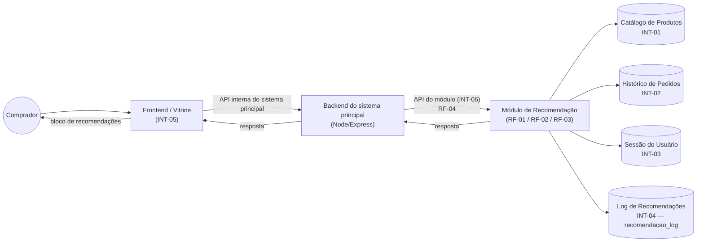
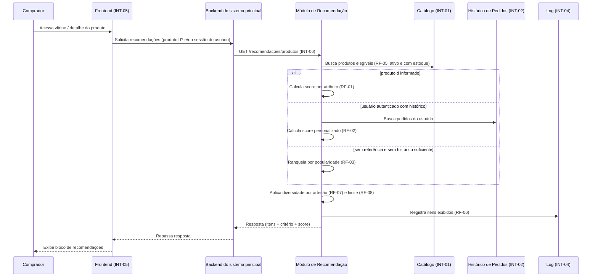

# Design — Módulo de Recomendação de Produtos (Origem / EP8 / HU15)

Identificadores (RF-XX / RNF-XX) idênticos aos de `documento-de-requisitos.md` e `requirements.md`.

## 1. Diagrama de componentes



O módulo é um componente interno ao backend do sistema principal (RNF-07): não existe acesso direto
do frontend a ele. Essa única fronteira (INT-06) é o que garante RNF-02 (contrato estável) e RNF-01
(degradação graciosa) — o frontend só sabe chamar o backend, o backend só sabe chamar o módulo por
essa API.

## 2. Fluxo dos dados



## 3. Modelo de dados

O módulo **não é dono** do catálogo nem do histórico de pedidos — apenas os lê (INT-01, INT-02). A
única estrutura de dados própria do módulo é o log de recomendações, já modelado em
`docs/Origem_DDL.md`:

```sql
CREATE TABLE recomendacao_log (
    id         BIGSERIAL PRIMARY KEY,
    usuario_id BIGINT REFERENCES usuario(id),      -- NULL quando comprador anônimo
    produto_id BIGINT NOT NULL REFERENCES produto(id),
    criterio   VARCHAR(30) NOT NULL,                -- mesma-tecnica | mesmo-artesao | mesma-regiao
                                                      -- | popularidade | personalizado
    score      NUMERIC(5,4),
    criado_em  TIMESTAMP NOT NULL DEFAULT now()
);
```

Cada chamada ao módulo que retorna N itens gera N linhas em `recomendacao_log` (RF-06), uma por
produto recomendado.

## 4. Estratégia principal e baseline

Baseline por regras + popularidade (definido no processo de validação deste documento, seguindo a
regra de escopo do backlog "começar a IA pelo baseline antes de modelos mais sofisticados").

**RF-01 — Score por atributo compartilhado** (mesmo cálculo já usado em
`recomendacoesService.recomendarSimilares`, agora formalizado):

| Atributo em comum com o produto de referência | Pontos |
|---|---|
| Mesmo artesão | +3 |
| Mesma técnica | +2 |
| Mesma região | +1 |

Produtos elegíveis (RF-05) são ordenados por score decrescente; só entram na lista os que têm
score > 0. Se nenhum produto tiver score > 0, aciona-se RF-03 (cold start).

**RF-02 — Personalização por comportamento:** a partir do histórico de pedidos do comprador (INT-02),
monta-se um "perfil de interesse" contando a frequência de cada técnica, artesão e região entre os
produtos já comprados. Esse perfil substitui o "produto de referência" único do RF-01: cada produto
do catálogo elegível recebe a soma dos pontos (mesma tabela acima) para cada atributo do perfil que
ele compartilha, ponderada pela frequência desse atributo no histórico. Produtos já comprados pelo
próprio usuário são excluídos do resultado.

**RF-03 — Popularidade (cold start):** ranking dos produtos elegíveis por número de unidades vendidas
(via `item_pedido`) e/ou número de avaliações recebidas, em uma janela de tempo configurável (ex.:
últimos 90 dias), com desempate pelo mais recente (`criado_em`).

**RF-07 — Diversidade:** após ordenar a lista final (por qualquer um dos três critérios acima),
percorre-se a lista aplicando um limite de no máximo 2 itens por `artesaoId`; candidatos excedentes
são descartados e substituídos pelo próximo da fila com score elegível.

## 5. Interface de integração

### `GET /api/recomendacoes/produtos`

Único ponto de entrada do módulo (RF-04 / INT-06). A estratégia (RF-01, RF-02 ou RF-03) é escolhida
internamente pelo módulo, na seguinte ordem de precedência:

1. Se `produtoId` for informado → tenta RF-01; se nenhum produto tiver score > 0, cai para RF-03.
2. Senão, se houver usuário autenticado (resolvido pela sessão do backend, nunca por parâmetro livre
   do cliente — ver seção 7) com histórico → tenta RF-02; se não houver histórico suficiente, cai
   para RF-03.
3. Senão → aplica RF-03 diretamente.

**Campos de entrada (query string):**

| Campo | Tipo | Obrigatório | Descrição |
|---|---|---|---|
| `produtoId` | number | Não | Produto de referência para similaridade (RF-01). |
| `limite` | number | Não | Quantidade de itens desejada (RF-08). Padrão 4, máximo 20. |

> `usuarioId` **não** é um campo de entrada da query string: o módulo obtém o comprador autenticado
> a partir da sessão validada pelo backend (ver seção 7 — Segurança), nunca de um parâmetro
> informado livremente pelo cliente.

**Campos de saída (200 OK):**

```json
{
  "criterioPredominante": "similaridade",
  "itens": [
    {
      "produtoId": 42,
      "nome": "Panela de barro pequena",
      "imagem": "https://.../produtos/42.jpg",
      "preco": 89.9,
      "artesao": "Ateliê Maria do Barro",
      "tecnica": "cerâmica",
      "regiao": "Alto do Moura",
      "criterio": "mesmo-artesao",
      "score": 0.75
    }
  ]
}
```

| Campo | Tipo | Descrição |
|---|---|---|
| `criterioPredominante` | `"similaridade" \| "personalizado" \| "popularidade"` | Estratégia efetivamente usada nesta resposta (RF-01/02/03). |
| `itens[].produtoId` | number | Identificador do produto recomendado. |
| `itens[].nome`, `.imagem`, `.preco`, `.artesao`, `.tecnica`, `.regiao` | — | Dados públicos do produto, suficientes para renderizar o bloco sem nova consulta (RNF-05: nunca inclui dado de outro usuário). |
| `itens[].criterio` | `"mesma-tecnica" \| "mesmo-artesao" \| "mesma-regiao" \| "popularidade" \| "personalizado"` | Motivo específico da recomendação daquele item (RF-09). |
| `itens[].score` | number (0–1) | Score normalizado usado na ordenação. |

**Erros possíveis:**

| Situação | Resposta | Critério relacionado |
|---|---|---|
| `produtoId` ou `limite` fora do formato esperado (não numérico) | `400 Bad Request` com mensagem legível | RF-04 |
| Produto informado em `produtoId` não existe no catálogo | `200 OK` com `itens: []` (não é erro de contrato — RF-01 exige lista vazia, não exceção) | RF-01 |
| Catálogo (INT-01) indisponível ou módulo interno falha inesperadamente | `503 Service Unavailable` | RNF-01 |

### Exemplo de requisição e resposta

**Requisição — recomendação por similaridade:**

```http
GET /api/recomendacoes/produtos?produtoId=42&limite=4 HTTP/1.1
```

**Resposta:**

```json
{
  "criterioPredominante": "similaridade",
  "itens": [
    { "produtoId": 57, "nome": "Vaso de barro médio", "imagem": "...", "preco": 65.0,
      "artesao": "Ateliê Maria do Barro", "tecnica": "cerâmica", "regiao": "Alto do Moura",
      "criterio": "mesmo-artesao", "score": 0.75 },
    { "produtoId": 61, "nome": "Boneca de argila", "imagem": "...", "preco": 40.0,
      "artesao": "Zé do Barro", "tecnica": "cerâmica", "regiao": "Alto do Moura",
      "criterio": "mesma-tecnica", "score": 0.5 }
  ]
}
```

**Requisição — cold start (usuário novo, sem `produtoId`):**

```http
GET /api/recomendacoes/produtos?limite=5 HTTP/1.1
```

```json
{
  "criterioPredominante": "popularidade",
  "itens": [
    { "produtoId": 12, "nome": "Renda renascença - toalha", "imagem": "...", "preco": 120.0,
      "artesao": "Cooperativa Renda de Pesqueira", "tecnica": "renda renascença",
      "regiao": "Pesqueira", "criterio": "popularidade", "score": 0.92 }
  ]
}
```

## 6. Tratamento de erros e estratégia de contingência

- **Validação de entrada:** parâmetros fora do formato esperado retornam `400` imediatamente, sem
  tentar nenhum cálculo (RF-04).
- **Timeout interno:** o módulo aplica um limite de tempo interno abaixo de RNF-03 (1s) para cada
  chamada às fontes de dados (INT-01/INT-02); se esse limite for excedido, o módulo aborta o cálculo
  de RF-01/RF-02 e cai diretamente para a lista de popularidade (RF-03), que deve ser mantida em
  cache leve (recalculada periodicamente em background, não a cada requisição), para que o caminho
  de contingência nunca dependa de um cálculo pesado em tempo real.
- **Indisponibilidade total:** se mesmo o fallback de popularidade não puder ser calculado (ex.:
  catálogo INT-01 fora do ar), o módulo responde `503`. O backend do sistema principal, por sua vez,
  deve tratar esse erro (e qualquer timeout na chamada ao módulo) engolindo a falha e não exibindo o
  bloco de recomendações (RNF-01) — o restante da tela nunca é bloqueado por causa do módulo.
- **Registro de falhas:** toda resposta de erro (400/503) também deve ser registrada em log técnico
  (distinto do `recomendacao_log`, que só guarda recomendações efetivamente exibidas), para permitir
  diagnosticar taxa de erro/timeout do módulo.

## 7. Segurança, privacidade e observabilidade

**Segurança:**
- A API do módulo (INT-06) só é chamada pelo backend do próprio sistema principal — nunca é exposta
  publicamente com acesso direto do navegador do comprador.
- O comprador usado na personalização (RF-02) é sempre resolvido pelo backend a partir da sessão já
  autenticada (mesmo mecanismo usado pelo restante do sistema principal), nunca aceito como
  parâmetro livre na requisição — isso impede que um cliente solicite recomendações "personalizadas"
  em nome de outro usuário.

**Privacidade:**
- A resposta da API (RNF-05) nunca inclui o histórico de pedidos do comprador, nem dados de outros
  usuários — apenas os dados públicos dos produtos recomendados.
- O `recomendacao_log` (INT-04) é uma estrutura interna do sistema principal, não exposta por
  nenhum endpoint público.

**Observabilidade:**
- Toda resposta bem-sucedida gera entradas em `recomendacao_log` (RF-06), permitindo consultas
  futuras por período, critério ou produto (RNF-06) — por exemplo, para calcular taxa de cliques por
  critério quando houver dado de comportamento suficiente ("avaliar recomendação por comportamento
  na U2", conforme o backlog).
- Recomenda-se registrar também, fora do escopo desta especificação, métricas técnicas básicas
  (tempo de resposta por chamada, taxa de acionamento do cold start) para acompanhar RNF-03 e a
  frequência de fallback.
